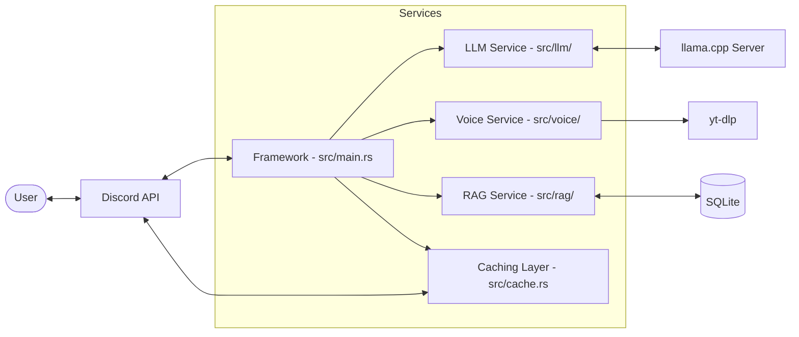

# Architecture: Mascord Discord Bot

## System Overview

Mascord is designed as a modular Discord bot focusing on local resource efficiency and clean separation of concerns.

## Components

### 1. Bot Framework (Poise/Serenity)
- **Responsibility**: Discord API interaction, gateway management, command dispatching.
- **Interface**: Uses `poise::Framework` for command routing.
- **Dependencies**: Discord Gateway.

### 2. Audio Service (Songbird)
- **Responsibility**: Voice channel state management, audio streaming, queue handling.
- **Compute**: Low (audio decoding via Opus).
- **Interface**: `src/voice/player.rs`.
- **Dependencies**: `yt-dlp`, `ffmpeg`.

### 3. LLM Client (async-openai)
- **Responsibility**: Communicating with `llama.cpp` server.
- **Compute**: Negligible (HTTP client).
- **Interface**: `src/llm/client.rs`.
- **Dependencies**: External `llama.cpp` server.

### 4. RAG Engine
- **Responsibility**: Message indexing, similarity search, prompt augmentation.
- **Storage**: SQLite (+ `sqlite-vec`).
- **Compute**: Moderate (vector arithmetic).
- **Interface**: `src/rag/mod.rs`.
- **Dependencies**: SQLite, `llama.cpp` (for embeddings).

### 5. Caching Layer (LruCache)
- **Responsibility**: Size-managed, thread-safe in-memory storage of recent Discord messages.
- **Efficiency**: Reduces SQLite/Discord API calls for frequently accessed data.
- **Interface**: `src/cache.rs`.
- **Dependencies**: `lru` crate.

## Data Storage

### SQLite Database
- **Location**: `data/mascord.db`
- **Tables**:
  - `messages`: Standard message history (guild_id, channel_id, user_id, content, timestamp).
  - `embeddings`: FTS and vector data for RAG.
  - `settings`: Per-server/channel configurations.

## Interfaces

