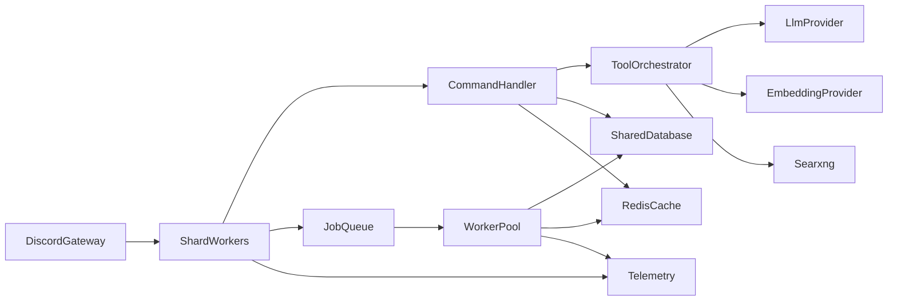

# Mascord: Benchmark-Driven Product & Multi-Server Spec

This document benchmarks Mascord against widely used Discord bots and official Discord platform guidance, then maps gaps to a phased roadmap tied to this repository. It is intended as an implementation-ready specification, not a marketing page.

---

## 1. References (sources)

| Source | What to borrow |
|--------|----------------|
| [Discord: Slash commands / application commands](https://docs.discord.com/developers/docs/interactions/slash-commands) | Naming rules, `default_member_permissions`, `contexts` / `integration_types`, global vs guild registration, command upserts |
| [Discord: Upgrading to application commands](https://discord.com/developers/docs/tutorials/upgrading-to-application-commands) | Slash vs user vs message commands, ephemeral responses, permissioning UX, migration from message-content reliance |
| [Dyno](https://dyno.gg/bot) | Dashboard-first configuration, moderation + automod as first-class, “everything togglable” operator mental model |
| [ProBot](https://probot.io/) | Welcome/embed tooling, reaction roles, leveling-style engagement loops, logs as a product surface |
| [MEE6: Getting started](https://help.mee6.xyz/support/solutions/articles/101000385394-getting-started-with-mee6) | Plugin model: enable/configure per feature; clear separation of moderation vs engagement vs economy |
| [MEE6: Automations](https://help.mee6.xyz/support/solutions/articles/101000546996-getting-started-with-mee6-automations) | Trigger → condition → action workflows; explicit platform limits and rate-limit awareness in product copy |

---

## 2. Product benchmark matrix

Legend: **Strong** = comparable or better for Mascord’s niche; **Partial** = exists but weaker than leaders; **Gap** = not a focus today or missing.

| Capability | Typical “big bot” pattern (Dyno / ProBot / MEE6-class) | Mascord today (`main` as of this spec) | Target direction |
|------------|--------------------------------------------------------|----------------------------------------|------------------|
| **Web dashboard** | Central place to configure modules, permissions, logs | **Gap** (CLI/env + slash only) | Phase 4: minimal admin web or “dashboard-lite” via Discord-only UX first |
| **Moderation** | Mutes, bans, logs, automod, case IDs | **Gap** (not core product) | Optional module: start with `/mod` + mod-log channel + role-gated commands |
| **Automations** | Trigger/condition/action workflows | **Gap** | Phase 4: subset—scheduled posts, keyword reactions, or integration with external automation |
| **Welcome / roles** | Welcome messages, autoroles, reaction roles | **Gap** | Phase 4 if community-focused; else document as out-of-scope |
| **Leveling / economy** | XP, rewards, leaderboards | **Gap** | Out-of-scope unless product pivot; keep Mascord differentiated on AI |
| **Slash command UX** | Polished descriptions, subcommands, permission defaults | **Partial** ([`src/commands/`](../src/commands/)) | Phase 1: align with Discord tutorial (ephemeral, deferrals, `default_member_permissions`) |
| **Context menus** | User/message commands for “do this to that message” | **Gap** | Phase 1: add message command for “remind me about this” / “summarize thread” where it reduces friction |
| **AI chat** | Often secondary or premium | **Strong** ([`src/commands/chat.rs`](../src/commands/chat.rs), LLM client) | Keep; add safety toggles and cost controls per guild |
| **Long-term memory / search** | Usually none or basic | **Strong** ([`src/commands/rag.rs`](../src/commands/rag.rs), [`src/db/mod.rs`](../src/db/mod.rs), indexer) | Phase 3: shared DB + embedding consistency guarantees |
| **Working memory / summaries** | N/A | **Strong** ([`src/summarize.rs`](../src/summarize.rs)) | Phase 3: single-writer job queue to avoid duplicate summarization |
| **Reminders** | Common utility | **Strong** ([`src/commands/reminder.rs`](../src/commands/reminder.rs), dispatcher in [`src/main.rs`](../src/main.rs)) | Phase 3: exactly-once delivery semantics with shared store |
| **Music** | Rich queue, filters, autoplay (varies by bot) | **Partial** ([`src/commands/music.rs`](../src/commands/music.rs), Songbird) | Phase 4: queue UX parity (shuffle, remove, clear, now playing) without scope creep |
| **Web tools** | Rare as first-party | **Strong** ([`src/tools/builtin/web.rs`](../src/tools/builtin/web.rs)) | Phase 2: SearXNG health checks, timeouts, abuse limits per guild |
| **Multi-tenant settings** | Per-guild modules in DB + UI | **Partial** ([`src/db/mod.rs`](../src/db/mod.rs) `settings`, `channel_settings`) | Phase 1–3: expand settings surface + document env vs per-guild overrides |
| **Observability** | Dashboards, status pages, metrics | **Gap** | Phase 2: structured logs, metrics, optional `/health` HTTP sidecar |
| **Horizontal scale** | Sharded gateways, workers, shared DB | **Gap** (single process, SQLite default) | Phase 3: architecture below |

---

## 3. Mascord positioning (what “clean” looks like)

**Differentiator:** agentic assistant with native tools (history/RAG, user memory, web fetch/search) and voice/music—not a clone of MEE6/Dyno.

**Non-goals (unless explicitly prioritized):** full moderation suite, economy, reaction-role builders. If added, they should be **optional modules** so the core stays maintainable.

**Clean product bar (inspired by leaders):**

1. **Discoverability:** Users find commands via `/` picker; descriptions read like product copy, not debug strings.
2. **Operator ergonomics:** Guild admins can understand “what the bot does” without reading Rust—via `/settings`, docs, or a future dashboard.
3. **Safe defaults:** Destructive or costly actions require permission bits and/or confirmation (pattern already started for agent tools in config).
4. **Predictable limits:** Rate limits, token budgets, and embedding backlog are visible in logs and configurable per env (guild-level later).

---

## 4. UX & command design standards (Discord-aligned)

Derived from [Upgrading to application commands](https://discord.com/developers/docs/tutorials/upgrading-to-application-commands) and [Slash commands](https://docs.discord.com/developers/docs/interactions/slash-commands):

### 4.1 Command types

| Type | Use when |
|------|----------|
| **Slash (`CHAT_INPUT`)** | Primary surface for Mascord (`/chat`, `/settings`, …) |
| **Message command** | Actions tied to a specific message (reminder, quote, “add to memory”) |
| **User command** | Actions tied to a user (timeout, profile card)—future moderation |

### 4.2 Naming & structure

- Follow Discord regex rules for slash command and option names (length, allowed characters, lowercase where required)—see official **Application command object** section.
- Prefer **one top-level command per domain** with **subcommands** (`/settings context|memory|…`) over many similarly named roots.
- Keep combined metadata under Discord’s **~8000 character** budget for command trees (including localizations if added).

### 4.3 Permissions & visibility

- Set **`default_member_permissions`** on commands that change server behavior or cost money (LLM calls): e.g. `/settings` subcommands for guild-wide limits → `MANAGE_GUILD` or `ADMINISTRATOR` as appropriate.
- Use **`contexts`** / **`integration_types`** for globally registered commands when Mascord should not appear in DMs or user-install contexts (per app settings).
- Prefer **ephemeral** responses for: settings readouts, search/RAG debug, errors with stack traces, and “admin-only” output—as recommended in Discord’s tutorial.

### 4.4 Interaction performance

- **Defer** long operations (LLM, RAG, web fetch, voice join) early; follow up with edit or follow-up messages.
- For multi-step agent flows, use components (buttons/selects) with timeouts aligned to `AGENT_CONFIRM_TIMEOUT_SECS` in [`src/config.rs`](../src/config.rs).

### 4.5 Registration hygiene

Current logic in [`src/main.rs`](../src/main.rs):

- `REGISTER_COMMANDS=true` + `DEV_GUILD_ID` → **guild** registration (fast iteration).
- `REGISTER_COMMANDS=true` without dev guild → **global** registration (slow propagation).

**Production rule:** keep `REGISTER_COMMANDS=false` on steady-state deploys; run registration as a **one-shot** release step.

---

## 5. Feature blueprint (by domain)

### 5.1 Memory & RAG

| Layer | Behavior | Code anchors |
|-------|----------|--------------|
| Short-term | In-memory LRU + optional time filter | [`src/cache.rs`](../src/cache.rs), [`src/context.rs`](../src/context.rs) |
| Working | Periodic summarization | [`src/summarize.rs`](../src/summarize.rs), [`src/main.rs`](../src/main.rs) spawn |
| Long-term | SQLite messages + embeddings + hybrid search | [`src/db/mod.rs`](../src/db/mod.rs), [`src/rag/mod.rs`](../src/rag/mod.rs), [`src/indexer.rs`](../src/indexer.rs) |
| User memory | Opt-in global profile | [`src/commands/memory.rs`](../src/commands/memory.rs), [`src/services/user_memory.rs`](../src/services/user_memory.rs) |

**Benchmark gap vs big bots:** they rarely ship semantic server memory; Mascord should **document privacy** (what is stored, retention, export/delete) at the same level as ProBot/MEE6 docs do for their plugins.

### 5.2 Agent & tools

| Tool | Role | Code anchor |
|------|------|-------------|
| `SearchLocalHistoryTool` | RAG | [`src/tools/builtin/rag.rs`](../src/tools/builtin/rag.rs) |
| `WebSearchTool` / `FetchUrlTool` | Live web | [`src/tools/builtin/web.rs`](../src/tools/builtin/web.rs) |
| Music play | Voice | [`src/tools/builtin/music.rs`](../src/tools/builtin/music.rs), [`src/voice/`](../src/voice/) |

**Cleanliness:** per-guild allowlists for web tools, max URLs per minute, and optional “safe search only” for SearXNG.

### 5.3 Reminders

- Durable rows in `reminders` table; dispatcher polls—[`src/reminders.rs`](../src/reminders.rs), [`src/services/reminder.rs`](../src/services/reminder.rs).
- **Benchmark:** parity with Dyno-style “simple reminders” is enough; workflow builders can wait.

### 5.4 Music

- Depends on host `yt-dlp` + `ffmpeg`; optional cookies—[`src/commands/music.rs`](../src/commands/music.rs), [`src/voice/`](../src/voice/).
- **Benchmark gap:** advanced filters/autoplay/24-7 modes are **Phase 4** polish, not blockers for “clean v1”.

### 5.5 Moderation & automations (optional future)

If pursued, mirror **MEE6 automation** mental model: **Trigger → Condition → Action**, with explicit Discord limits called out in admin UI copy (rate limits, channel types)—see [MEE6 Automations](https://help.mee6.xyz/support/solutions/articles/101000546996-getting-started-with-mee6-automations).

---

## 6. Reliability & multi-server architecture

### 6.1 Current single-node reality

[`src/main.rs`](../src/main.rs) runs, in one process:

- Discord gateway + Poise
- Multiple `tokio::spawn` loops: summarization, cache cleanup, DB retention, user-memory cleanup, reminder dispatcher, embedding indexer, voice file cleanup

**SQLite** ([`DATABASE_URL`](../src/config.rs)) is correct for homelab/single host; it is **not** sufficient for active-active multi-instance.

### 6.2 Target topology (multi-server production)

| Component | Purpose |
|-----------|---------|
| **ShardWorkers** | Discord gateway; scale-out requires **sharding** (mandatory at high guild counts per Discord platform rules) and a **shard coordinator** |
| **SharedDatabase** | Postgres (recommended) or other HA SQL; migrations from [`src/db/schema.rs`](../src/db/schema.rs) |
| **JobQueue** | Redis Stream / SQS / NATS for summarization, embedding backfill, reminder delivery, cleanup—**exactly one consumer** or lease-based workers |
| **RedisCache** | Hot cache for channel/guild settings; optional replacement for purely in-memory LRU for cross-process consistency |
| **Telemetry** | OpenTelemetry traces + metrics; log aggregation |

### 6.3 Multi-instance rules

1. **At most one active reminder delivery worker** per logical bot (or use row-level locking / `SKIP LOCKED` dequeue).
2. **At most one summarization “leader”** per channel or per guild (lease in DB/Redis).
3. **Embedding indexer** must not double-embed: use `is_indexed` + transactional claim pattern.
4. **Voice/music** stays **sticky** to the process that joined the channel (do not load-balance voice across nodes without shared Lavalink-style architecture).

---

## 7. Phased roadmap (implementation order)

Each phase lists **entry points** in this repo.

### Phase 1 — Product & UX hardening

| Item | Acceptance criteria | Code / config anchors |
|------|---------------------|------------------------|
| Command taxonomy pass | No duplicate/confusing roots; subcommand groups documented in [`docs/COMMANDS.md`](COMMANDS.md) | [`src/commands/*.rs`](../src/commands/) |
| Permission defaults | Sensitive `/settings` and `/admin` guarded via `default_member_permissions` | Poise attrs on commands; reference Discord docs |
| Ephemeral + defer | Long commands defer; noisy output ephemeral | [`src/commands/chat.rs`](../src/commands/chat.rs), RAG, agent paths |
| Context menu MVP | At least one message command reducing need for copy/paste | New command module + register in [`src/main.rs`](../src/main.rs) |
| Onboarding copy | `/help` or pinned doc pattern for new guilds | Docs + optional single `/about` command |

### Phase 2 — Operability baseline

| Item | Acceptance criteria | Anchors |
|------|---------------------|---------|
| Structured logging | JSON logs optional via env; correlation id per interaction | [`src/main.rs`](../src/main.rs) tracing setup |
| Health | Process liveness: systemd `Type=simple` + `Restart=`; optional HTTP `/health` sidecar | Deploy docs ([`README.md`](../README.md)) |
| Config validation | Fail fast on bad URLs (LLM, embedding, SearXNG) | [`src/config.rs`](../src/config.rs) |
| SearXNG abuse limits | Per-guild rate limit config | [`src/tools/builtin/web.rs`](../src/tools/builtin/web.rs) |
| Release runbook | Command registration one-shot documented | [`README.md`](../README.md), this doc §8 |

### Phase 3 — Multi-server readiness (core)

| Item | Acceptance criteria | Anchors |
|------|---------------------|---------|
| Postgres (or equivalent) | Single migration path; no split-brain SQLite | [`src/db/mod.rs`](../src/db/mod.rs), [`src/db/schema.rs`](../src/db/schema.rs) |
| Outbox / job queue | Background tasks dequeue with leases | Replace raw `tokio::spawn` loops in [`src/main.rs`](../src/main.rs) |
| Distributed reminder delivery | No duplicate DMs/posts | [`src/reminders.rs`](../src/reminders.rs) |
| Sharding plan | Document when to shard; automate shard count | New `docs/SHARDING.md` (future) |
| Secrets | No secrets in repo; rotation procedure | `.env.example` only placeholders |

### Phase 4 — Feature parity polish (selective)

| Item | Benchmark | Notes |
|------|-----------|--------|
| Music queue UX | Dyno-class “queue management” | [`src/commands/music.rs`](../src/commands/music.rs) |
| “Automations lite” | MEE6-style triggers (subset) | New module; keep scope small |
| Admin dashboard | Dyno/ProBot | Only after API boundaries exist |

---

## 8. Release gates & checklists

### 8.1 Every release

- [ ] `cargo test` and `cargo clippy -- -D warnings` (or project CI equivalent).
- [ ] `REGISTER_COMMANDS=false` in production env.
- [ ] If command schema changed: one-shot `REGISTER_COMMANDS=true` with `DEV_GUILD_ID` (staging) then promote global if needed.
- [ ] Smoke: Discord API reachable; LLM `/v1/models` or chat probe; embedding probe; SearXNG probe (if enabled).
- [ ] Verify bot has required intents (see [`README.md`](../README.md) Message Content Intent).

### 8.2 Multi-server cutover gate

- [ ] Shared database live; backups configured.
- [ ] Only one scheduler leader OR queue consumers with idempotent handlers.
- [ ] Load test: reminder burst + indexer backlog + `/chat` concurrency without deadlock.
- [ ] Rollback plan: previous image + DB migration down (if applicable).

### 8.3 Security gate

- [ ] Token rotation if ever exposed in logs or tickets.
- [ ] Review privileged intents; minimize `MESSAGE_CONTENT` usage over time per Discord migration guidance.
- [ ] Web tools: SSRF protections (allowlist schemes, block private IPs) if fetching arbitrary URLs.

---

## 9. Related internal docs

- [`ARCHITECTURE.md`](ARCHITECTURE.md) — component overview (note: may mention legacy areas; prefer this spec for scale-out).
- [`REQUIREMENTS.md`](REQUIREMENTS.md) — original functional goals.
- [`GAP_ANALYSIS.md`](GAP_ANALYSIS.md) / [`IMPLEMENTATION_ROADMAP.md`](IMPLEMENTATION_ROADMAP.md) — historical planning; reconcile with phases here.

---

## 10. Summary

Mascord is **strong** in AI, memory, and tooling versus typical multipurpose bots, but **weak** in dashboard, moderation, and horizontal scale. A **clean** path forward is: **Phase 1** Discord-native UX parity, **Phase 2** operability, **Phase 3** shared state + job orchestration for true multi-server, **Phase 4** selective parity features that do not dilute the AI core.
