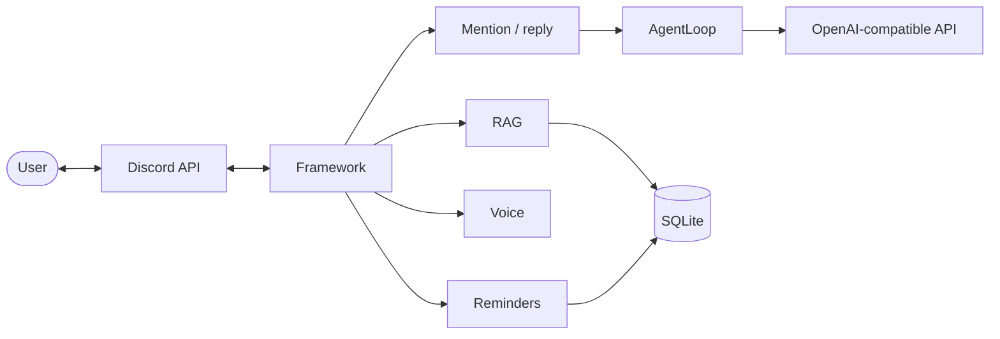

# Internals

Architecture, requirements summary, module map, and project status.

## Architecture

Mascord is a Rust Discord bot (Poise/Serenity): **gateway** → commands/handlers → **services** (LLM, RAG, voice, tools, reminders, cache). SQLite holds messages, summaries, settings, reminders, user memory, and AutoDream audit lines. **OpenAI-compatible** LLM + optional separate embedding endpoint. **Voice:** Songbird + `yt-dlp` + ffmpeg. **Agent:** `ToolRegistry` + built-in tools only (no MCP runtime).

---

## Memory system (how data flows)

Memory is **not** one blob. Four cooperating layers feed the model and tools; each has different scope, retention, and update triggers.

### 1. Short-term (conversation context)

- **What:** Verbatim recent messages for the **current channel**, taken from the in-process **message cache** (and retention rules).
- **Where:** `cache.rs`, assembled in `context.rs` → `ConversationContext::get_context_for_channel`.
- **Limits:** Guild defaults from `config` (`CONTEXT_MESSAGE_LIMIT`, `CONTEXT_RETENTION_HOURS`), overridable per guild via `/settings`. Per-channel **tracking** and **memory start date** (`channel_settings`) can disable context or only include messages after a cutoff.
- **Injected as:** User/assistant lines (bot posts → assistant role), oldest-first, after any working-memory line for that channel.

### 2. Working memory (per-channel summary)

- **What:** A **rolling LLM summary** of older activity so long threads stay coherent without fitting full history into the window.
- **Where:** `channel_summaries` in SQLite; text is loaded in `context.rs` and prepended as a **system** line (“Earlier conversation summary for this channel: …”).
- **How it is produced:** `summarize.rs` (`SummarizationManager`): background timer + optional `/settings context summarize`. Uses message windows, optional **refresh** passes over a lookback, and extracts **milestones** (short durable bullets in `channel_milestones`).
- **Quiet servers:** If `SUMMARIZATION_ACTIVITY_MIN_MESSAGES` is positive, each tick is skipped unless **activity** reaches that threshold within `SUMMARIZATION_ACTIVITY_GATE_HOURS`. Activity is **`max` (persisted `messages` rows, in-memory short-term cache count)** for the same window—so assistant/synthetic lines that exist only in short-term context still count, without double-counting the same user message that appears in both.
- **Related env:** `SUMMARIZATION_*` in `.env.example`.

### 3. Long-term (RAG)

- **What:** Embedding-indexed message history for **semantic** recall (`/search`, hybrid + filters, channel/guild scope).
- **Where:** `messages` table + embeddings; `indexer.rs` backfills; `rag/` for search.
- **Retention:** `LONG_TERM_RETENTION_DAYS` (hourly cleanup of old rows).

### 4. Global user memory (opt-in)

- **What:** A **per-Discord-user** profile (preferences, stable facts the user asked to remember), separate from channel history.
- **Where:** `user_memory` table; `services/user_memory.rs`.
- **Injected as:** A short system/user snippet in replies and mentions when enabled; full profile via agent tool `get_user_memory`.
- **Updates:** After interactions, **`auto_update_memory`** may merge new facts (separate LLM call) unless the user opted out with phrases like “no memory” (`should_skip_memory`).
- **User control:** `/memory` (enable/disable, remember, forget, TTL, `delete_data`).

### AutoDream (background consolidation)

- **What:** Optional **maintenance passes** inspired by “sleep consolidation”: deduplicate bullets, drop stale noise, resolve obvious contradictions **without inventing new facts**. Applies to **enabled user memory rows** and, if configured, **channel working-memory summaries**.
- **Where:** `services/autodream.rs`; DB columns `user_memory.autodream_at`, `channel_summaries.autodream_at`; optional `autodream_log` (last ~500 lines of short audit text).
- **When:** On a timer (`AUTODREAM_INTERVAL_SECS`). Each row is eligible again after `AUTODREAM_MIN_HOURS` since its last `autodream_at` (or never consolidated). Caps per cycle limit LLM cost (`AUTODREAM_MAX_USERS_PER_CYCLE`, `AUTODREAM_MAX_CHANNELS_PER_CYCLE`).
- **Quiet servers:** Same pattern as summarization ( **`max`(DB, short-term cache)** for the gate window). With a positive `AUTODREAM_ACTIVITY_MIN_MESSAGES`, the whole cycle is skipped unless that threshold is met. Channel consolidation only considers summaries for channels that had at least one row in `messages` within `AUTODREAM_CHANNEL_ACTIVITY_HOURS` (set to `0` to disable that filter).
- **Default:** **On** (`AUTODREAM_ENABLED=true`), including **channel working-memory summaries** (`AUTODREAM_CHANNEL_SUMMARIES=true`). Set `AUTODREAM_ENABLED=false` to disable extra LLM consolidation calls.
- **Multi-instance:** Respects `JOB_LEASES_ENABLED` with lease name `autodream` when set.

#### Rolling summary vs AutoDream (coordination)

This mirrors the usual **Claude Code–style split**: *live* memory work (here: rolling merge of **new** messages into the channel summary) vs **offline** consolidation (dedupe/cleanup without changing what counts as “already summarized”).

| Concern | Rolling summary (`summarize.rs`) | AutoDream (`services/autodream.rs`) |
|--------|-----------------------------------|-------------------------------------|
| **Role** | Fold **new** chat into working memory; optional periodic **refresh** rebuild | Clean **existing** summary text (and user bullets): redundancy, drift, weak phrasing |
| **Channel `updated_at`** | **Bumps** every save — this is the **message cursor** for `count_channel_messages_since` | **Left unchanged** on success so the “what’s new since last roll” window stays correct |
| **Channel `autodream_at`** | Not written by rolling | **Bumped** when a dream pass completes (even if text unchanged, when CAS succeeds) |
| **Concurrency** | — | **Compare-and-swap** on `updated_at` (`*_autodream_cas` in `db/mod.rs`). If rolling summarization committed while AutoDream was running, the dream write **does not apply**; the next cycle retries. User memory uses the same pattern vs `/memory` and auto-update. |
| **Milestones** | Extracted after each rolling save | Re-extracted after a **successful** channel dream write via shared `extract_milestones_for_summary` (`summarize.rs`) so milestones match consolidated text |

**Tuning:** If you want dream to run **after** rolling has had time to merge new traffic, set **`AUTODREAM_MIN_HOURS`** larger than your effective rolling cadence (see `SUMMARIZATION_INTERVAL_SECS` and triggers). The code does not enforce this; it is an operational choice.

---

## Requirements (summary)

- Slash commands; reply + mention chat; embeds; markdown degraded for Discord.
- LLM + layered memory above + RAG with hybrid search and channel controls.
- Music: `yt-dlp`, queue, cookies optional, unified `music` tool (`action` mirrors slash commands) in guild, plus mention/reply direct play-intent fast route for reliability.
- Reminders: NL schedules, SQLite, dispatch throttled.
- Agent: built-in tools, confirmation for risky tools, iteration limits.
- Owner-only admin; secrets via env; user data deletion path (`/memory delete_data`).
- Config: `.env` + `.env.example`; small footprint; macOS + Linux.

## Module map

| Area | Main paths |
|------|------------|
| Bot / lifecycle | `main.rs`, `config.rs`, `reply.rs`, `mention.rs`, `discord_text.rs` |
| LLM / agent | `llm/client.rs`, `llm/agent.rs` |
| RAG | `rag/mod.rs`, `db/mod.rs` |
| Tools | `tools/` |
| Voice | `commands/music/`, `voice/` |
| Context / summaries | `context.rs`, `summarize.rs`, `cache.rs` |
| Reminders | `reminders.rs`, `services/reminder.rs` |
| User memory | `services/user_memory.rs` |
| AutoDream | `services/autodream.rs` |
| System prompt / time | `system_prompt.rs` |

**Prompts:** Main behavior lives in `SYSTEM_PROMPT` (guild override or `config.rs` default). A second system line injects **time only** (`system_prompt.rs`)—no duplicate tool rules; that matches common agent patterns (instructions vs. facts).

## Status and gaps

- **Memory (2026):** Vector search, rolling summarization, AutoDream consolidation, music cookies, and agent safety guards are implemented; optional `sqlite-vec` remains a future acceleration path.
- **Open:** At-rest DB encryption not documented (use OS-level encryption if needed). Some commands still touch DB directly instead of a thin service layer (testing/maintainability).
- **Multi-instance:** Use shared DB + `JOB_LEASES_ENABLED`; single writer for background jobs (summarization, embedding indexer, reminders, AutoDream).

## Security note (2026-01-30)

A Brave Search API key was once committed in `mcp_servers.toml`; history was scrubbed and the file is gitignored. **Rotate any exposed keys**; do not commit secrets. Mascord does not ship an MCP client today; treat API keys as env-only.
